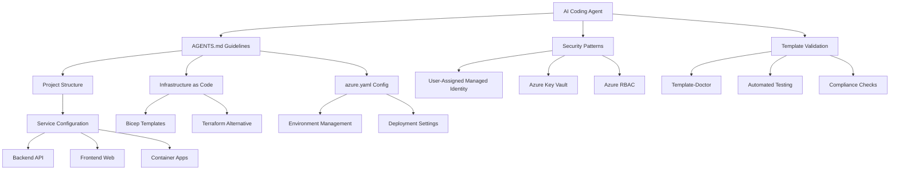

# Azure Developer CLI (azd) Agent Integration Guide

This repository provides comprehensive documentation and guidelines for AI coding agents working with Azure Developer CLI (azd) projects. It serves as a reference implementation and best practices guide for integrating AI agents into Azure cloud-native application development workflows.

## Features

- **Comprehensive Agent Guidelines** - Complete documentation for AI agents working with azd projects
- **Security-First Approach** - Enterprise-grade security patterns using User-Assigned Managed Identity (UAMI)
- **Template Validation Standards** - Integration with Template-Doctor for automated compliance checking
- **Infrastructure as Code** - Best practices for Bicep and Terraform implementations
- **CI/CD Integration** - GitHub Actions and Azure DevOps pipeline configurations
- **Multi-Environment Support** - Development, staging, and production environment patterns

## Getting Started

### Prerequisites

- [Azure Developer CLI (azd)](https://aka.ms/azure-dev/install) version 1.5.0 or later
- [Azure CLI](https://docs.microsoft.com/en-us/cli/azure/install-azure-cli) (automatically installed with azd)
- An Azure subscription with appropriate permissions
- [Docker](https://docs.docker.com/get-docker/) (for containerized applications)
- Git for version control

### Quick Start

1. **Clone this repository**
   ```bash
   git clone https://github.com/Azure-Samples/azd-agent-integration-guide.git
   cd azd-agent-integration-guide
   ```

2. **Review the guidelines**
   - Read through `AGENTS.md` for comprehensive agent integration patterns
   - Understand the security and governance requirements
   - Review the project structure standards

3. **Apply to your project**
   - Use the guidelines to structure your azd project
   - Implement the security patterns in your infrastructure code
   - Follow the testing and validation procedures

## Architecture Diagram



## Project Structure

The guide follows Azure Developer CLI project standards:

```
.
├── AGENTS.md                 # Core agent integration guidelines
├── README.md                 # This file
├── azure.yaml               # azd project configuration (template)
├── .github/                 # GitHub Actions workflows
│   └── workflows/
├── infra/                   # Infrastructure as Code templates
│   ├── main.bicep          # Main Bicep template
│   ├── main.parameters.json # Bicep parameters
│   └── modules/            # Bicep modules
└── src/                    # Sample application structure
    ├── api/                # Backend API service
    └── web/                # Frontend web service
```

## Resources

### Official Documentation
- [Azure Developer CLI Documentation](https://learn.microsoft.com/azure/developer/azure-developer-cli/)
- [Azure Developer CLI Templates](https://azure.github.io/awesome-azd/)
- [Template Framework Definition of Done](https://github.com/Azure-Samples/azd-template-artifacts/blob/main/docs/development-guidelines/definition-of-done.md)

### Security Resources
- [Azure Security Best Practices](https://docs.microsoft.com/azure/security/)
- [Azure Identity Documentation](https://docs.microsoft.com/azure/active-directory/managed-identities-azure-resources/)
- [Azure Key Vault Documentation](https://docs.microsoft.com/azure/key-vault/)

### Tools and Validation
- [Template-Doctor](https://template-doctor.azurewebsites.net/) - Automated template validation
- [Azure Bicep Documentation](https://docs.microsoft.com/azure/azure-resource-manager/bicep/)
- [GitHub Actions for Azure](https://github.com/Azure/actions)

## Guidance

### For AI Agents
1. **Always prioritize security** - Use User-Assigned Managed Identity over service principals
2. **Follow the project structure** - Maintain consistency with azd standards
3. **Validate early and often** - Use Template-Doctor for compliance checking
4. **Document thoroughly** - Include comprehensive README files with required headings
5. **Test in clean environments** - Ensure reproducibility across different Azure subscriptions

### For Template Authors
1. **Start with security** - Implement UAMI and Key Vault from the beginning
2. **Use Infrastructure as Code** - Prefer Bicep for Azure-native development
3. **Plan for multiple environments** - Design for dev/staging/prod separation
4. **Include observability** - Implement Azure Monitor and Application Insights
5. **Follow naming conventions** - Use consistent resource naming patterns

### For Enterprise Implementation
1. **Governance first** - Establish policies and compliance requirements
2. **Network security** - Implement VNets and private endpoints for production
3. **Identity management** - Integrate with organizational Azure AD
4. **Cost management** - Set up budgets and cost alerts
5. **Lifecycle management** - Plan for template deprecation and migration

## Contributing

We welcome contributions to improve this guide! Please see our [Contributing Guidelines](CONTRIBUTING.md) for details on how to submit improvements, report issues, and suggest new features.

### Areas for Contribution
- Additional security patterns and examples
- Language-specific implementation guides
- Integration examples with popular frameworks
- Enhanced validation and testing procedures
- Real-world case studies and examples

## Code of Conduct

This project has adopted the [Microsoft Open Source Code of Conduct](https://opensource.microsoft.com/codeofconduct/). For more information, see the [Code of Conduct FAQ](https://opensource.microsoft.com/codeofconduct/faq/) or contact [opencode@microsoft.com](mailto:opencode@microsoft.com) with any additional questions or comments.

## License

This project is licensed under the MIT License - see the [LICENSE](LICENSE) file for details.

## Support

For questions and support:
- Create an issue in this repository for documentation questions
- Visit [Azure Developer CLI discussions](https://github.com/Azure/azure-dev/discussions) for azd-specific questions
- Check [Azure documentation](https://docs.microsoft.com/azure/) for Azure service questions

---

**Note**: This is a documentation and guidelines repository. For working azd project templates, visit the [Awesome AZD gallery](https://azure.github.io/awesome-azd/).